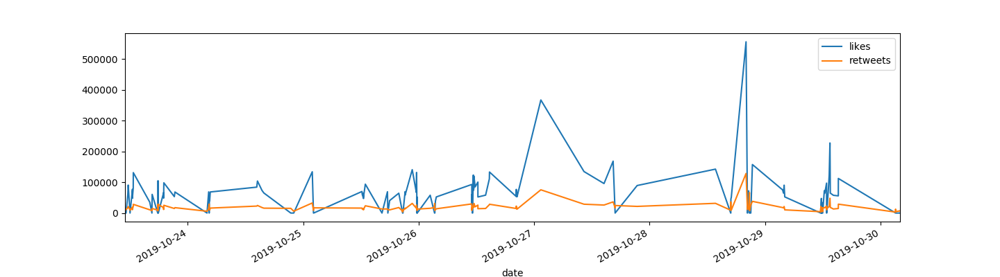

# Project Lucy plus Twitter Sentiment Analysis

## Description
Project Lucy is basically a collection of programs which interact with the Twitter API. We chose to particularly focus on creating a Twitter bot as well as performing sentiment analysis. All this achieved using Python library tweepy as well as textblob for the latter. 

## Project Lucy:

+ User communicating with Lucy:

  * Lucy will automatically reply to every hashtag containing #kanye, #dict and #help when tweeted
  * Lucy will analyse tweets for sentiment sentiment analysis
  * Lucy will produce a plot to represent the result; a graph of th enumber of likes/ retweets a user gets in a span of one week.
  * Lucy is able to update a status
  * Lucy is able to upload a picture

## Features
+ Word definition
+ Random Quote 
+ Summary plot of most liked tweets and most retweets
+ Sentiment Analysis

  
## Behavior Driven Development

| Input                     | Behaviour                       |       Output                      |
| ------------------------- | ------------------------------  | ----------------------------------|
| Mentioning @Lucy with  #help     | Lucy replying the tweet with a set of instructions on how to interact with her.        | Display the tweet tweeted by lucy in response to the sender with instructions. |
| Mentioning @Lucy #dict followed by any word                         |  Lucy will reply to your tweet with a definition of the word                               |     Display the tweet tweeted by lucy in response to the sender.  If the word is misplet, Lucy will recommend a word with the closest match to the one typed.                               |
|  Mentioning @Lucy with the hashtag #Kanye / #ye / #KanyeWest                           | Lucy will reply with a random quote from Kanye West                                | Display the tweet tweeted by lucy in response to the sender.                                  | 
| The username and tweet limit                         | A table af tweet summary will be displayed                                |  A plot of most liked tweets and most retweets as well as sentiment analysis table will be shown                                 |

## Built with

    - Python 3
    - Tweepy (Python wrapper for the Twitter API.)
    - Pandas

## Requirements
+ This program requires python3.+ (and pip) installed, a guide on how to install python on various platforms can be found [here](https://www.python.org/)
+ Twitter Consumer Key, Consumer Secret, Access Token and Access Token Secret which can be got by applying at developer.twitter.com

## Installation
+ **Step 1** : Clone this repository using **`git clone https://github.com/collinsmuriuki/blog.git`**, or downloading a ZIP file of the code.
+ **Step 2** : The repository, if downloaded as a .zip file will need to be extracted to your preferred location and opened
+ **Step 3** : Go to the project root directory and install the virtualenv library using pip an afterwards create a virtual environment. Run the following commands respectively:
    * **`pip install virtualenv`**
    * **`virtualenv venv`**
    * **`source venv/bin/activate`**
        * Note that you can exit the virtual environment by running the command **`deactivate`**
+ **Step 4**: Install all the dependencies by running the commmand 
    * **`` pip install -r requirements.txt ``**
+ **Step 5**: Create a run.sh file in which you will export the Api key/ secret and Access token/ secret as environmental variables. Make the file executable by running the command **`chmod a+x run.sh`**
    * To use the bot, type the command **`python3 bot.py`** 
        * Login to Twitter to interact with it.
    To use sentiment analysis, type the command **`python3 user_analysis.py`**
        * Interact with the termainal to obtain results

## Sample Results
### Twitter Sentiment Analysis Test

##### Testing most liked last 200 tweets of @realDonaldTrump

##### Testing most retweeted last 200 tweets of @realDonaldTrump

##### Testing both most liked and retweeted last 200 tweets of @realDonaldTrump

## Known bugs

+ App crashes randomly while listening for tweets and hashtags, looking into this
+ App crashes once it responds to a tweet constaining the hashtag meme, as a result we have disabled this feature temporarily

## Author

+ [Mick Ganza](https://github.com/RuTpasswd)
+ [Collins Muriuki](https://github.com/collinsmuriuki)
+ [Isaac Gichuru](https://github.com/Isaacg94)
+ [Titus Ouko](https://github.com/costamay)

## Contact 

In any case do not hesitate to reach the team at:
* murerwacollins@gmail.com

 ## Licence

This project is Licensed under [GNU GPL-v3.0](LICENSE)